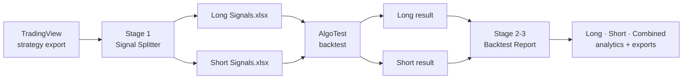

<div align="center">

# Split Generate
### From a raw TradingView export to a boardroom-ready Long + Short backtest report — in minutes, not hours.

[](https://splitgenerate.streamlit.app/)


[](https://github.com/uj-28/Split_Generate/actions/workflows/tests.yml)


### **[Try the live app: splitgenerate.streamlit.app](https://splitgenerate.streamlit.app/)**

</div>

---

## The problem

Backtesting a TradingView strategy on AlgoTest used to mean:

1. Export the signals from TradingView
2. **Manually** split Long and Short rows into two Excel files
3. Backtest each on AlgoTest
4. **Manually** merge the two results and build the report

Steps 2 and 4 are slow, easy to get wrong, and impossible to audit.

## The fix

**Split Generate** automates both ends of that workflow and keeps AlgoTest in the middle, exactly where it belongs.



---

## What you get

### Stage 1 — Signal Splitter
- Splits on the `Type` column (`Entry/Exit long|short`), so **exits always stay with their own entry's direction**
- **Zero data loss:** `Long + Short + Unclassified = Source rows` is checked and shown on screen
- Keeps original row order and every value — only the date format is (optionally) changed
- Unclassified rows are **listed, never silently dropped**, with a downloadable validation report
- Clear errors for missing columns, wrong file types and empty files
- Downloads as `.xlsx` or `.csv`

### Stage 2–3 — Backtest Report
| | |
|---|---|
| **Three views** | Long-only, Short-only and Combined, side by side |
| **KPI cards** | Net P&L, win rate, profit factor, max drawdown, and more |
| **Charts** | Cumulative P&L, underwater drawdown, yearly bars, rolling-window returns, P&L distribution, activity |
| **Monthly heatmap** | Year × month grid with green/red shading and Indian digit grouping |
| **Regime analysis** | Compare the full period against everything after a split date you choose |
| **Rolling returns** | Worst / median / average / best result for 1, 3, 6, 12 month holding windows |
| **Filters** | Date range, year, month — everything updates together |
| **Trade ledger** | All / Long / Short / Winning / Losing tabs with search and Excel / CSV export |
| **Robust import** | Slippage-adjusted exports, reordered columns, `.csv` or `.xlsx`, merged reports (`Trade #`) |
| **Honest by design** | Rejected rows are listed; anything that can't be computed shows **n/a** instead of a guess |

### Stage 3 — Strategy Hub
A separate, dark-themed account-level dashboard for merging **any number** of files at once — AlgoTest, StockMock,
or your own earlier reports, mixed freely in one upload.

| | |
|---|---|
| **Multi-format, multi-file** | AlgoTest (either column layout), StockMock basket workbooks, and a previously-exported report — format is auto-detected per file; one bad file never stops the others |
| **StockMock-verified** | Checked against a real 9-strategy file: Net P&L matched StockMock's own "Overall Profit" and day-level win/loss count to the rupee |
| **StockMock's own margin** | If a file carries an "Estimated Margin", tick a box to use it as capital instead of typing one in |
| **KPI cards + charts** | Net P&L, win rate, profit factor, max drawdown, avg trade — smooth spline equity curve with a zoomable range slider, underwater drawdown %, yearly bars, win/loss split |
| **Monthly & Yearly matrix** | Year × month grid, every figure shown directly (no hover needed) |
| **Day-wise Breakdown** | Every trading day in one table by default (no year/month pick required) + a calendar-style day-of-month heatmap table + a zoomable daily P&L bar chart |
| **19 section toggles** | Show or hide any individual table or chart — hiding it on screen never removes it from the Excel export |
| **Combined master trade log** | Chronological, with a Source column, searchable, All/Winning/Losing/By-file tabs, CSV/Excel export |
| **Remembers your upload** | Navigate to another page and back — your last report is still there, with a Clear button to start over |

---

## Supported file formats

Every format below is **auto-detected** — you never pick one, and on Stage 3 you can mix all of them in a single
upload. A file that doesn't match any of these gives a clear error instead of a crash or a silent skip.

| Page | Format | What it looks like | Notes |
|---|---|---|---|
| **1 · Signal Splitter** | TradingView strategy export | `.csv` / `.xlsx` with `Trade number`, `Type`, `Date and time`, `Price` columns | Long and Short rows together, in any order |
| **2 · Backtest Report** | AlgoTest (standard) | `.csv` / `.xlsx`: `Index`, `Entry Date`, `Entry Time`, `Exit Date`, `Exit Time`, `P/L` (+ optional `Type`/`Strike`/`B/S`/`Qty`/prices/`Vix`) | One parent row per trade, optional leg rows |
| **2 · Backtest Report** | Merged trade report | `.csv` / `.xlsx`: `Trade #`, `Entry`/`Exit Date`/`Time`, `P/L`, no leg rows | One row = one trade already |
| **3 · Strategy Hub** | AlgoTest (standard) | same as above | |
| **3 · Strategy Hub** | AlgoTest (detailed) | `.csv` / `.xlsx`: `Entry-Date`, `Instrument-Kind`, `StrikePrice`, `Position`, `ExitDate`, `ExpiryDate`, `Remarks`, … | AlgoTest's newer, more detailed export layout |
| **3 · Strategy Hub** | StockMock basket workbook | `.xlsx` with a `Basket Strategies` sheet and one `# S-n - Result` sheet per strategy | One row per expiry cycle, from every enabled strategy; no per-leg price/entry-time at this level |
| **3 · Strategy Hub** | A previous report from this app | `.xlsx` this app gave you before (Backtest Report or an earlier Strategy Hub export) | Its `Trades` sheet is re-imported directly, so you can merge an older report back in |

Slippage-adjusted AlgoTest exports work everywhere — the file's own `P/L` is used exactly as given, never recalculated.

---

## Quick start

```bash
git clone https://github.com/uj-28/Split_Generate.git
cd Split_Generate

python -m venv .venv
.venv\Scripts\activate            # Windows   (macOS/Linux: source .venv/bin/activate)

pip install -r requirements.txt
python -m streamlit run app.py
```

Your browser opens at **http://localhost:8501**. The app starts on an **Instructions** page with the full guide.

> If `streamlit run app.py` says *"streamlit is not recognized"*, use `python -m streamlit run app.py` as above —
> Python's `Scripts` folder just isn't on your PATH. Need another port? Add `--server.port 8502`.

## How to use it

| Step | Where | What you do |
|:-:|---|---|
| 1 | **TradingView** | Export the strategy trade list (Long and Short rows together) |
| 2 | **Signal Splitter** | Upload it → check the counts → download **Long Signals** and **Short Signals** |
| 3 | **AlgoTest** | Backtest each file separately and download both results |
| 4 | **Backtest Report** | Upload the Long and Short results in the sidebar → filter, read, export |

Want a PDF? Use your browser's **Print → Save as PDF** with *Background graphics* on.

**Merging more than two files, or StockMock results?** Skip to **Strategy Hub** instead — drop in any number of
AlgoTest and/or StockMock files (and a previous report, if you have one) in one go.

---

## How the numbers are calculated

Every figure comes from the trade records — nothing is estimated.

| Metric | Definition |
|---|---|
| Trade | One AlgoTest trade row; P&L is its `P/L`. Leg rows are cross-checked, never added twice |
| Direction | The file (Long / Short) the trade was uploaded in |
| Win rate | Winning trades ÷ **all** trades |
| Profit factor | Gross profit ÷ \|gross loss\| — *n/a* when there are no losses |
| Equity curve | Cumulative P&L by **exit time**, starting from 0 |
| Max drawdown | Largest drop below the running peak (closed-trade basis) |
| Return / MDD | Annualised P&L ÷ max drawdown |
| Combined metrics | Recomputed from the combined trades — **never** an average of Long and Short |
| % returns | Only when you enter a capital; otherwise *n/a* |
| *Strategy Hub:* Equity curve | Starts at **Initial Capital**, then adds each trade's Net P&L in exit-time order (not 0) |
| *Strategy Hub:* Net P/L | Gross P/L (the file's own figure) minus that trade's even share of Total Charges |
| *Strategy Hub:* Day totals | Every trade across every uploaded file that **exited** that calendar day, summed — the same basis StockMock itself uses for its day-level Win%/Max Profit figures |

The Instructions page inside the app has the complete list.

---

## Two ways to use it

**1. Use the hosted app (no setup)**
Open **<https://splitgenerate.streamlit.app/>** in your browser and upload your files. Nothing to install.

**2. Run it on your own system**
Follow the [Quick start](#quick-start) above. Your files then never leave your computer.

## Project layout

```
app.py                         entry point + navigation
core.py                        all logic: splitting, AlgoTest/StockMock import, metrics
report.py                      HTML/CSS building blocks + shared (light) design - Stages 1-2
hub.py                         HTML/CSS building blocks for the Strategy Hub's dark theme
views/                         (not 'pages/' - that name makes Streamlit flash its default menu)
  0_Instructions.py            in-app user guide
  1_Signal_Splitter.py         stage 1
  2_Backtest_Dashboard.py      stages 2-3
  3_Strategy_Hub.py            stage 3 - multi-file AlgoTest/StockMock merge
tests/test_core.py             tests against your own example files (local-only, see below)
tests/test_smoke.py            synthetic-data tests - run everywhere, including CI
.streamlit/config.toml         theme + upload limit
legacy_clktrd_app.py           original .clktrd viewer (not in the menu)
```

## Tests

```bash
python -m pytest tests -q
```

- `tests/test_smoke.py` uses synthetic data, so it runs anywhere. It pushes fake TradingView, AlgoTest (both column
  layouts), StockMock and re-imported-report files through the whole pipeline (split → import → merge → metrics →
  Excel report), checks a bad file never crashes a multi-file upload, and confirms every page renders without an error.
- `tests/test_core.py` checks the splitter and every KPI against your real example files, recalculated independently.
  Those CSVs are local-only (never committed), so these tests are **skipped** wherever the files aren't present.
- **GitHub runs the tests on every push** (`.github/workflows/tests.yml`). A red ❌ on the commit, plus an email,
  means something broke.

## Keeping the live app stable

- `requirements.txt` pins the exact library versions the app is tested with, so a new release can't break it
  overnight. To upgrade: change a version, run the tests, then push.
- The live app redeploys automatically on every push to `main`. Never delete files on GitHub directly; if it happens,
  revert the commit and run **Reboot app** on Streamlit.

## Your data stays yours

`.gitignore` blocks `*.csv`, `*.xlsx`, `*.xls`, `*.pdf`, `*.clktrd`, `*.json` and generated `Long/Short Signals` files,
so trade data can't be committed by accident. The app processes uploads in memory only; nothing is stored on the server.

## FAQ

**Does it work with slippage-adjusted AlgoTest files?** Yes — the file's own `P/L` is used exactly as given.

**What if a row can't be classified?** It's listed with a reason and excluded from both files — never silently lost.

**Why is a metric showing n/a?** It can't be computed from the data (e.g. profit factor with zero losing trades, ROI without capital).

**Is drawdown intraday?** No. AlgoTest trade files only contain closed trades, so drawdown is closed-trade based.

**Can I mix AlgoTest and StockMock files together?** Yes — on Strategy Hub, upload any combination in one go; each
file's format is detected automatically.

**How accurate is the StockMock import?** Checked against a real 9-strategy basket: Net P&L matched StockMock's own
"Overall Profit" to the rupee, and the day-level win/loss count matched its Win%/Loss% exactly.

**What if one of my files is corrupted or the wrong format?** Strategy Hub shows that one file as a red error chip
with the reason, and still builds the report from every other file you uploaded.

## Disclaimer

Backtested results are hypothetical and do not guarantee future performance. Figures include only the costs and
slippage already inside your AlgoTest files.
