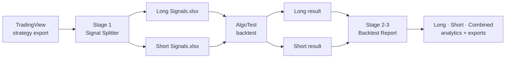

<div align="center">

# Split Generate
### From a raw TradingView export to a boardroom-ready Long + Short backtest report — in minutes, not hours.

[](https://splitgenerate.streamlit.app/)


### **[Try the live app: splitgenerate.streamlit.app](https://splitgenerate.streamlit.app/)**

</div>

---

## The problem

Backtesting a TradingView strategy on AlgoTest used to mean:

1. Export the signals from TradingView
2. **Manually** split Long and Short rows into two Excel files
3. Backtest each on AlgoTest
4. **Manually** merge the two results and build the report

Steps 2 and 4 are slow, easy to get wrong, and impossible to audit.

## The fix

**Split Generate** automates both ends of that workflow and keeps AlgoTest in the middle, exactly where it belongs.



---

## What you get

### Stage 1 — Signal Splitter
- Splits on the `Type` column (`Entry/Exit long|short`), so **exits always stay with their own entry's direction**
- **Zero data loss:** `Long + Short + Unclassified = Source rows` is checked and shown on screen
- Keeps original row order and every value — only the date format is (optionally) changed
- Unclassified rows are **listed, never silently dropped**, with a downloadable validation report
- Clear errors for missing columns, wrong file types and empty files
- Downloads as `.xlsx` or `.csv`

### Stage 2–3 — Backtest Report
| | |
|---|---|
| **Three views** | Long-only, Short-only and Combined, side by side |
| **KPI cards** | Net P&L, win rate, profit factor, max drawdown, and more |
| **Charts** | Cumulative P&L, underwater drawdown, yearly bars, rolling-window returns, P&L distribution, activity |
| **Monthly heatmap** | Year × month grid with green/red shading and Indian digit grouping |
| **Regime analysis** | Compare the full period against everything after a split date you choose |
| **Rolling returns** | Worst / median / average / best result for 1, 3, 6, 12 month holding windows |
| **Filters** | Date range, year, month — everything updates together |
| **Trade ledger** | All / Long / Short / Winning / Losing tabs with search and Excel / CSV export |
| **Robust import** | Slippage-adjusted exports, reordered columns, `.csv` or `.xlsx`, merged reports (`Trade #`) |
| **Honest by design** | Rejected rows are listed; anything that can't be computed shows **n/a** instead of a guess |

---

## Quick start

```bash
git clone https://github.com/uj-28/Split_Generate.git
cd Split_Generate

python -m venv .venv
.venv\Scripts\activate            # Windows   (macOS/Linux: source .venv/bin/activate)

pip install -r requirements.txt
python -m streamlit run app.py
```

Your browser opens at **http://localhost:8501**. The app starts on an **Instructions** page with the full guide.

> If `streamlit run app.py` says *"streamlit is not recognized"*, use `python -m streamlit run app.py` as above —
> Python's `Scripts` folder just isn't on your PATH. Need another port? Add `--server.port 8502`.

## How to use it

| Step | Where | What you do |
|:-:|---|---|
| 1 | **TradingView** | Export the strategy trade list (Long and Short rows together) |
| 2 | **Signal Splitter** | Upload it → check the counts → download **Long Signals** and **Short Signals** |
| 3 | **AlgoTest** | Backtest each file separately and download both results |
| 4 | **Backtest Report** | Upload the Long and Short results in the sidebar → filter, read, export |

Want a PDF? Use your browser's **Print → Save as PDF** with *Background graphics* on.

---

## How the numbers are calculated

Every figure comes from the trade records — nothing is estimated.

| Metric | Definition |
|---|---|
| Trade | One AlgoTest trade row; P&L is its `P/L`. Leg rows are cross-checked, never added twice |
| Direction | The file (Long / Short) the trade was uploaded in |
| Win rate | Winning trades ÷ **all** trades |
| Profit factor | Gross profit ÷ \|gross loss\| — *n/a* when there are no losses |
| Equity curve | Cumulative P&L by **exit time**, starting from 0 |
| Max drawdown | Largest drop below the running peak (closed-trade basis) |
| Return / MDD | Annualised P&L ÷ max drawdown |
| Combined metrics | Recomputed from the combined trades — **never** an average of Long and Short |
| % returns | Only when you enter a capital; otherwise *n/a* |

The Instructions page inside the app has the complete list.

---

## Two ways to use it

**1. Use the hosted app (no setup)**
Open **<https://splitgenerate.streamlit.app/>** in your browser and upload your files. Nothing to install.

**2. Run it on your own system**
Follow the [Quick start](#quick-start) above. Your files then never leave your computer.

## Project layout

```
app.py                         entry point + navigation
core.py                        all logic: splitting, AlgoTest import, metrics
report.py                      HTML/CSS building blocks + shared design
pages/
  0_Instructions.py            in-app user guide
  1_Signal_Splitter.py         stage 1
  2_Backtest_Dashboard.py      stages 2-3
tests/test_core.py             automated tests
.streamlit/config.toml         theme + upload limit
legacy_clktrd_app.py           original .clktrd viewer (not in the menu)
```

## Tests

```bash
python -m pytest tests -q
```

The tests check the splitter against hand-split example files and recompute every KPI independently.
They need those example CSVs in the folder **above** the project — they are deliberately **not** in this repo
(see below), so on a fresh clone the data-driven tests will fail until you add your own files.

## Your data stays yours

`.gitignore` blocks `*.csv`, `*.xlsx`, `*.xls`, `*.pdf`, `*.clktrd`, `*.json` and generated `Long/Short Signals` files,
so trade data can't be committed by accident. The app processes uploads in memory only; nothing is stored on the server.

## FAQ

**Does it work with slippage-adjusted AlgoTest files?** Yes — the file's own `P/L` is used exactly as given.

**What if a row can't be classified?** It's listed with a reason and excluded from both files — never silently lost.

**Why is a metric showing n/a?** It can't be computed from the data (e.g. profit factor with zero losing trades, ROI without capital).

**Is drawdown intraday?** No. AlgoTest trade files only contain closed trades, so drawdown is closed-trade based.

## Disclaimer

Backtested results are hypothetical and do not guarantee future performance. Figures include only the costs and
slippage already inside your AlgoTest files.
